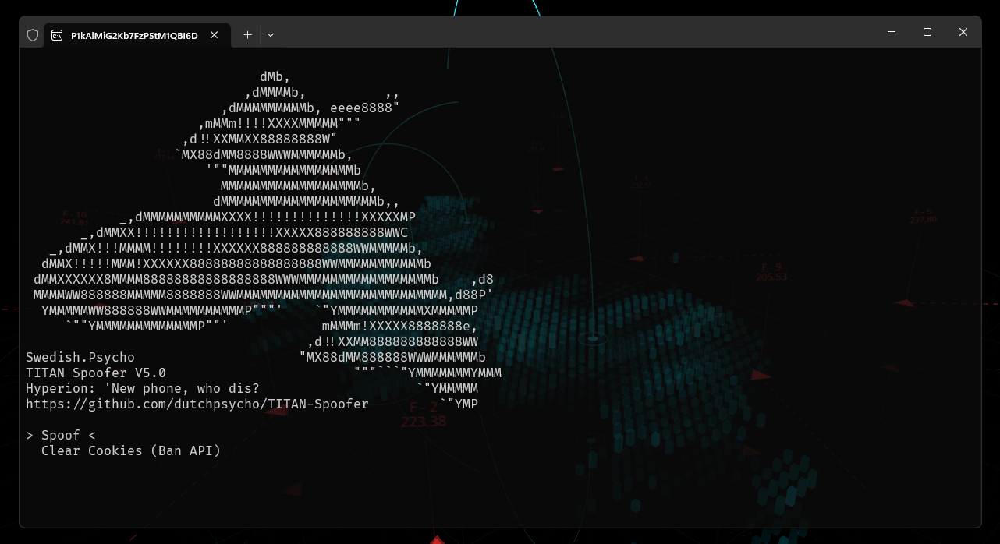
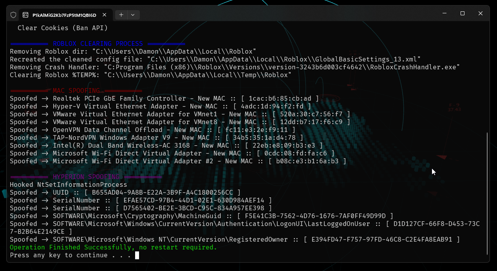

# TITAN Spoofer (Roblox, Hyperion)

TITAN Softwork Solutions © 2024

.png)



**[TITAN's](https://discord.gg/yUWyvT9JyP)** Spoofer is a tool designed to spoof various hardware identifiers (HWIDs) and cookies on your PC to evade Hyperion's detection vecs & Roblox's ban API.

Recently, Roblox introduced it's ban API & combined it with Hyperion's detection vectors, after seeing executor developers create paid spoofers I decided to do the exploiting community a favour & make a free one.

The idea is to spoof after you've exploited, before you go back onto your main. Once you're done with your main & wanna exploit again, spoof. You get the idea (Hopefully)


## Features 💎

- 🎯 **Fully Targeted**: This spoofer targets Roblox in specific, meaning it spoofs exactly what Roblox checks. This is not for other games.
- 👤 **Roblox Ban API Evasion**: The spoofer essentially voids Roblox's attempts to detect your alt accounts system side.
- 💻 **Hyperion Unban**: If you're banned by Hyperion the spoofer completely removes that (403 Auth err or Roblox js doesn't open)
- ⚠️ **No System Instability or Critical Changes**: Everything the spoofer changes should have no affect to anything else on your system, this is NOT kernel.
- 📚 **Complete Anti-Ban Bible**: A complete Anti-Ban or "Ban Evasion" guide exists within the TITAN Discord.

<br>

# 📈 Version History

### **V5 > V5.1**

- Removed fingerprint spoofing to resolve conflicts with PC executors' key systems.

<details>
  <summary>🔽 View V4.5 > V5 Changes</summary>

- Added fingerprint spoofing using the same method as Synapse X.
- Implemented spoofing for CPUID, PC HWID, PDS, SID, HDD, CPU, and more.
- Introduced string encryption for enhanced security.
- Added a self-elevation technique for smoother operations.
- Reorganized project structure for better maintainability.

</details>

<br>

# 📦 Installation & Setup

Prefer not to compile the code yourself? **[Download the binaries from TITAN's Discord](https://discord.gg/yUWyvT9JyP).**

Otherwise, follow the steps below:

1. **Clone the Repository**

    ```sh
    git clone https://github.com/dutchpsycho/TITAN-Spoofer.git
    cd TITAN-Spoofer
    ```

2. **Open the Solution File (.sln)**

    - Launch **Visual Studio** (ensure it's the correct version).
    - Navigate to the cloned repository directory.
    - Open `TITAN Spoofer.sln`.

3. **Build the Project**

    - In Visual Studio, go to `Build` > `Build Solution`.
    - The compiled binaries will be located in the `/x64` directory.

**Usage Reminder:**
- Spoof after exploiting and before returning to your main account.
- Repeat spoofing before each new exploit session.

<br>

# 🌐 Additional Information

**Hyperion** is Roblox's Anti-Tamper, owned by Byfron, owned by Roblox.

### Components:

1. **TITAN Spoofer.exe**
   - Features a Command Line Interface (CLI) navigated w arrow keys.
   - Option to clear your Roblox cookie cache.

2. **TITAN Spoofer THEMIDA.exe**
   - A protected version of TITAN Spoofer.

3. **Cache Cleaner**
   - If the cache cleaner in `TITAN Spoofer.exe` fails, use `Python/CookieCacheCleaner.py` to auto clear the Roblox cookie cache.

<br>

# 🎓 Credits

- **Developer:** Damon
- **Contributors:** Terror, bstaipan, .ranu

<br>

# 🎟️ Get Support

Join our [Discord Community](https://discord.gg/yUWyvT9JyP) for support, updates, and to connect with other users.

<br>

# ⚠️ Disclaimer

This software is intended for educational and research purposes only. Using this tool to bypass security measures or violate the terms of service of any software, including Roblox, is strictly prohibited. The developers do not endorse or support any illegal activities and will not be held responsible for any misuse of this software.
