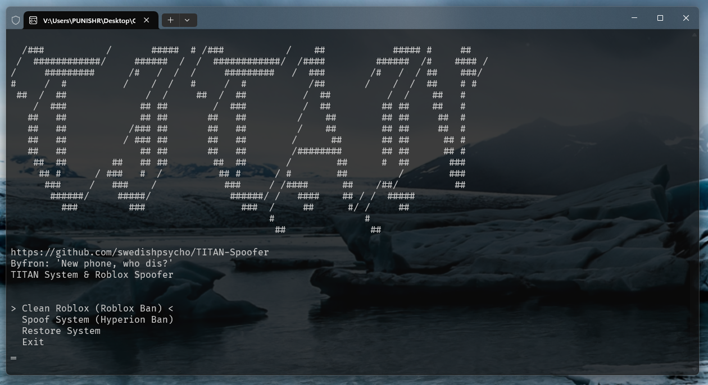

# TITAN Spoofer/Woofer (Roblox)

TITAN © 2024 by Damon is licensed under CC BY-NC-ND 4.0



**[TITAN's](https://discord.gg/yUWyvT9JyP)** Spoofer is a tool designed to spoof various hardware identifiers (HWIDs) and cookies on your system to evade Roblox's detection mechanisms and ban API.

[](https://creativecommons.org/licenses/by-nc-nd/4.0/)
[](https://discord.gg/yUWyvT9JyP)

## Disclaimer 📜

This software is intended for educational and research purposes only. Using this tool to bypass security measures or violate the terms of service of any software, including Roblox, is strictly prohibited. The developers do not endorse or support any illegal activities and will not be held responsible for any misuse of this software.

## Features 💎

- **Hyperion & Ban API Evasion** 🛡️: Spoofs keys and cleans files that Roblox and Hyperion use to detect alternative accounts.
- **Roblox Cookie Cache Cleaning** 🍪: Cleans Roblox.com cookies from specified browsers.

## Installation 📂

If you prefer not to compile the code yourself, download the release from **[TITAN's Discord](https://discord.gg/yUWyvT9JyP)**. For those who want to compile from source, follow these steps:

1. **Clone the repository:**

    ```sh
    git clone https://github.com/hatesiku/TITAN-Spoofer.git
    cd TITAN-Spoofer
    ```

2. **Open the .sln file with Visual Studio and build the project in Release mode.** The compiled files will be located in `/x64/Release`.

    - [Microsoft Visual Studio](https://visualstudio.microsoft.com/vs/)

## Requirements ⚠️

- Windows OS 10/11 x64
- .NET Framework 4.0+
- Visual Studio with C++ Development tools installed

## Usage 💻

1. Compile the project and locate the release files.

## Credits/Developer 🎓

- Discord: Swedish.Psycho
