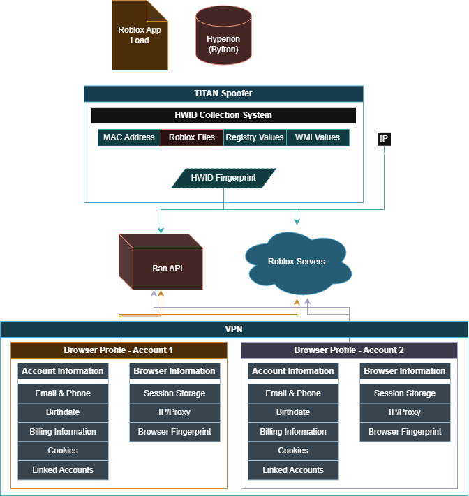

# **TITAN Spoofer** (Roblox)

[](https://discord.gg/yUWyvT9JyP)

# OVERVIEW

[TITAN's](https://titansoftwork.net) Spoofer is designed to protect your Main/Alt accounts from Byfron's HWID tracking & Roblox's Ban API. To use this effectively, a VPN is essential.

The Spoofer prevents the other accounts on your PC from being banned when exploiting (Scenario: You exploit on alt, spoof, switch to main -> Only alt gets banned)

With Roblox integrating a ban API and combining Hyperion (Byfron's) detection mechanisms, exploit developers have begun offering paid spoofers. I've decided to give the community a **free, open-source** solution.  

High-Level Overview of Roblox's System's in motion 



### HOW IT WORKS

The spoofer deletes Roblox & all relevant files then changes hardware identifiers (HWID's) that Roblox specifically checks. Then, (Assuming you have Bloxstrap or Fishstrap) will automatically re-install Roblox. This is done purely in usermode and any altered values will reset on PC restart.

If you'd like any functionality stripped/removed the source is extremely clear and can be easily altered & recompiled for personal use.

<br>

# FEATURES
- **Ban API/Byfron Fingerprinting Bypass** - Spoofer changes all values used in it's HWID check.
- **Byfron HWID Ban Removal** – This'll get around the extremely rare HWID bans.
- **Automated Roblox Reinstallation** – Uses **Bloxstrap/Fishstrap** for reinstallation, with **RobloxInstaller** as a fallback.  
- **Antiban Guide** – Includes a full guide on avoiding bans and understanding how the Ban API & Byfron works, available in the **[TITAN Discord](https://hub.titansoftwork.net)**.  

<br>

# INSTALL & SETUP
### DOWNLOAD
For prebuilt binaries (.exe's), download the latest version from the Discord ``#spoofer`` channel **[TITAN Discord](https://hub.titansoftwork.net).**  

### COMPILING REQUIREMENTS:
- **Visual Studio** (Latest Version)  
- **C++ Build Tools** (Install via Visual Studio Installer)  

### BUILDING FROM SOURCE:
1. **Clone the Repository**  
    ```sh
    git clone https://github.com/TITAN-Softwork-Solutions/Roblox-Spoofer-Byfron.git
    cd TITAN-Spoofer
    ```

2. **Open the Solution File (`.sln`)**  
    - Navigate to the cloned repository.  
    - Open `TITAN Spoofer.sln` using **Visual Studio**.  

3. **Build the Project**  
    - Click **Build Solution**.  
    - The compiled executable (`.exe`) will be located in the `/Release` directory.  

<br>

# API

### TITAN DLL
TITAN.dll provides these exports:
```C++
extern "C" __declspec(dllexport) void RunSpoofer()
extern "C" __declspec(dllexport) void KillRoblox()
extern "C" __declspec(dllexport) void SpoofMAC()
extern "C" __declspec(dllexport) void CleanFS()
extern "C" __declspec(dllexport) void SpoofRegistry()
extern "C" __declspec(dllexport) void SpoofWMI()
```
See ``DLL/DLLmain.cpp`` for in-depth

### TITAN.h

#### **Example Usage**

```cpp
#include "TITAN.h"

std::thread TitanThread = TitanSpoofer::run(true);

TitanThread.join();
```

### API REF
#### FUNCTION `TitanSpoofer::run(bool logs)`
- **Params:**
  - `logs` (`true`/`false`): Enables or disables logging. If `false`, suppresses all `std::cout` output except critical errors.  
- **Return Value:** A `std::thread` object executing the spoofing process asynchronously.  


### IMPORTANT NOTES
- The Spoofer does NOT unban you from specific games OR on-site bans (Eg; Roblox website bans)

## SUPPORT
For problems, open a support ticket via the **[TITAN Discord](https://hub.titansoftwork.com)**.  

## License

TITAN Spoofer is licensed under Apache 2.0 with the Commons Clause.

- You may use, modify, and redistribute the software with attribution.
- You may **not Sell** the software or any service whose value derives substantially from it.
- Commercial use is prohibited unless you obtain explicit written permission from TITAN Softwork Solutions.

## LEGAL
This software is provided for **educational and research purposes only**. The use of this tool to **circumvent security protections** or violate the terms of service of **Roblox or any other platform** is strictly prohibited. The developers **do not endorse or condone** any illegal activities and assume no liability for misuse.
