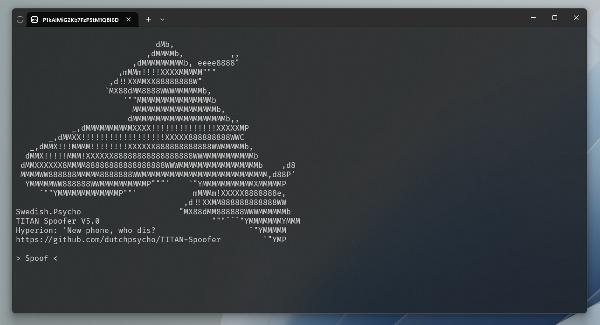
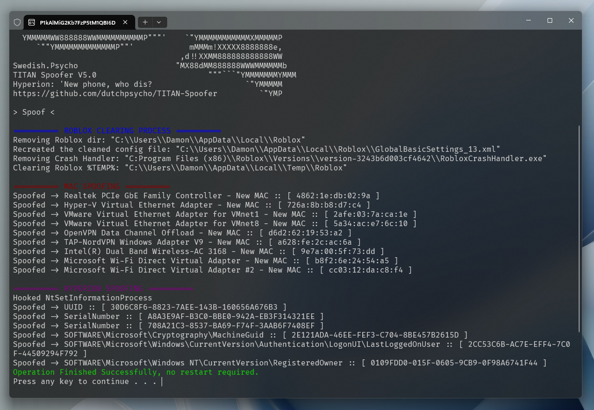

# TITAN Spoofer (Roblox, Hyperion)

TITAN Softwork Solutions © 2024




.png)

# 📜 Context

**[TITAN's](https://discord.gg/yUWyvT9JyP)** Spoofer is a tool designed to spoof various hardware identifiers (HWIDs) on your PC to evade Hyperion's (Byfron) detection vectors & Roblox's ban API.

Recently, Roblox introduced it's ban API & combined it with Hyperion's (Byfron) detection vectors, after seeing executor developers create paid spoofers I decided to do the exploiting community a favour & make a free one.

The idea is to spoof after you've exploited, before you go back onto your main. Once you're done with your main & wanna exploit again, spoof. You get the idea (Hopefully)

# 💎 Features

- 👥 **Ban API & Alt Detection evasion**: Using this gives your PC a whole new identitiy, Roblox will have no idea your alts & main are linked.
- 🔐 **Hyperion/HWID Unban**: If you're HWID banned (Hyperion banned) this'll fix that for you.
- 📚 **Complete Anti-Ban Bible**: A complete Anti-Ban guide exists within the TITAN Discord.

<br>

# 📈 Version History

I've forgotten what I've changed recently due to this being taken down for so long. Currently on version 6.2

<details>
  <summary>🔽 View V5 > V5.1 Changes</summary>

- Removed fingerprint spoofing to resolve conflicts with PC executors' key systems.

</details>

<details>
  <summary>🔽 View V4.5 > V5 Changes</summary>

- Added fingerprint spoofing using the same method as Synapse X.
- Implemented spoofing for CPUID, PC HWID, PDS, SID, HDD, CPU, and more.
- Introduced string encryption for enhanced security.
- Added a self-elevation technique for smoother operations.
- Reorganized project structure for better maintainability.

</details>

<br>

# 📦 Installation & Setup

Prefer not to compile the code yourself? **[Download the exe from TITAN's Discord](https://discord.gg/yUWyvT9JyP).**

### 📚 Requirements

Visual Studio & It's C++ build tools

### 🖥️ Guide

1. **Clone the Repository**

    ```sh
    git clone https://github.com/dutchpsycho/Roblox-TITAN-Spoofer-Hyperion.git
    cd TITAN-Spoofer
    ```

2. **Open the Solution File (.sln)**

    - Open the cloned repository directory.
    - Open `TITAN Spoofer.sln` in Visual Studio.

3. **Build the Project**

    - First, set the compilation type to Release.
    - Then, click Build Solution.
    - The compiled binarie (exe) will be located in the `/x64` directory.

**Usage Reminder:**
- Spoof after exploiting and before returning to your main account.
- Repeat spoofing before each new exploit session.

<br>

# 🎟️ Get Support

Join the [Discord Community](https://discord.gg/yUWyvT9JyP) for support, updates, and to connect with other users.


<br>

# ⚠️ Disclaimer

This software is intended for educational and research purposes only. Using this tool to bypass security measures or violate the terms of service of any software, including Roblox, is strictly prohibited. The developers do not endorse or support any illegal activities and will not be held responsible for any misuse of this software.
