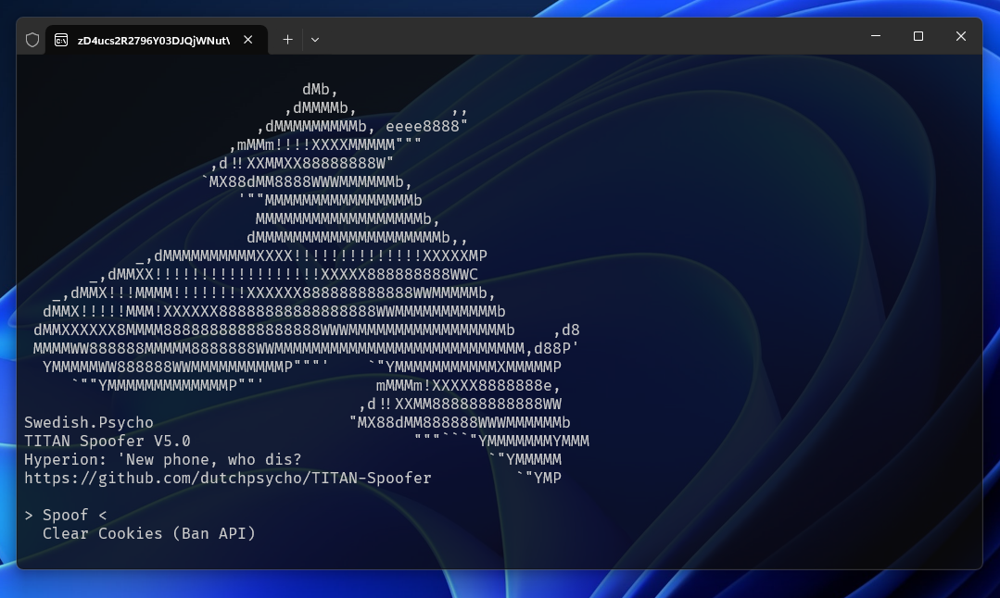
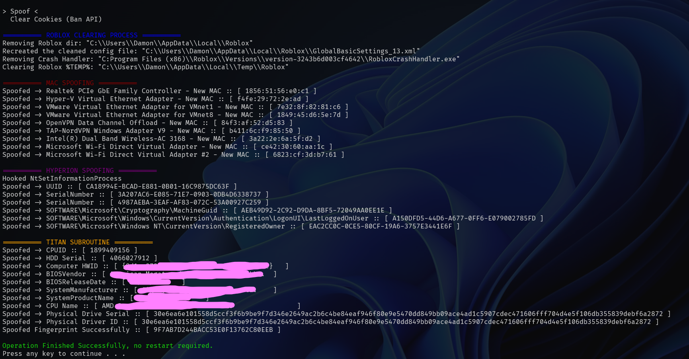

# TITAN Spoofer (Roblox, Hyperion)

TITAN © 2024 by Damon is licensed under CC BY-NC-ND 4.0

.png)



**[TITAN's](https://discord.gg/yUWyvT9JyP)** Spoofer is a tool designed to spoof various hardware identifiers (HWIDs) and cookies on your PC to evade Hyperion's detection mechanisms and Roblox's ban API.

[](https://creativecommons.org/licenses/by-nc-nd/4.0/)
[](https://discord.gg/yUWyvT9JyP)

## Features 💎

- 🎯 **Fully Targeted**: This spoofer targets Roblox & It's AntiCheat in specific.
- 👤 **Roblox Ban API Evasion**: The spoofer essentially negates Roblox's attempts to detect your alt accounts system side.
- 🔐 **Hyperion Unban**: If you're banned by Hyperion (HWID banned) the spoofer completely removes that.
- ⚠️ **No System Instability or Critical Changes**: Everything the spoofer changes should have no affect to anything else on your system. 
- 📚 **Complete Anti-Ban Bible**: A complete Anti-Ban or "Ban Evasion" guide exists within the TITAN Discord.

## V4.5 > V5 📈

- Added fingerprint spoofing, same method Synapse X used
- Added CPUID, PC HWID, PDS, SID, HDD, CPU... spoofing
- Added string encryption
- Added self-elevation technique
- Re-Organized project

<details>
  <summary><h3>V4.2 -> V4.5 📈</h3></summary>

- Resolved issue where your Roblox mouse sense, volume & graphic settings would be changed after spoofing (Due to removal of GlobalXML) I've created a function to re-generate this post spoofing.
- Replaced NT Hook with Inlined
- Added more fallbacks
- Quality of Life

</details>

<details>
  <summary><h3>V4.0 -> V4.2 📈</h3></summary>

- Fixed errors where you'd have to install vcruntime or msvc dll's (C++ comp tools)
- Dynamically linked SQL3.dll (No need to keep it as an external file now)
- Removed SQL3.dll, no longer needed.

</details>

<details>
  <summary><h3>V3.6 -> V4.0 📈</h3></summary>

- Confirmed spoofer works as of banwave on 2024-08-23(23rd Aug, 2024)
- Completely resolved all MAC spoofing issues & bugs
- Changed to use Windows Instrumentals for MAC spoofing
- Changed the way the CLI handles logs
- Refactored Project Layout & Solution
- Removed useless functionality (SigFucker Mem)

</details>

<details>
  <summary><h3>V3.1 -> V3.6 📈</h3></summary>

- Added Headless version (No UI, just run to spoof, can be put in startup)
- Added targeted Browser Cookie Cleaning (Option on UI version, not included in Headless)
- Added backup for this in case `SQL3.dll` fails or dynamic linking fails `(Python/CookieCacheCleaner.py)`
- Added DebugProtect from Roblox
- Added useful logging
- Added fallbacks depending on spoofs
- Fixed E-DID spoofing
- Fixed WMIC initialization
- Removed useless registry spoofs
- Fixed rare buffer overflow 
- Removed restoration logic (Annoying to maintain, nobody uses it)

</details>

<details>
  <summary><h1>Installation & Setup 📦</h3></summary>

If you prefer not to compile the code yourself, you can download the exe's (Binaries) from **[TITAN's Discord](https://discord.gg/yUWyvT9JyP)**. Otherwise, follow the guide below.

1. **Clone the repository:**

    ```sh
    git clone https://github.com/dutchpsycho/TITAN-Spoofer.git
    cd TITAN-Spoofer
    ```

2. **Open the Solution File (.sln):**

   - Launch Visual Studio (The purple one, not blue)
   - Navigate to the directory where the repository was cloned.
   - Open the `TITAN Spoofer.sln` file.

3. **Configure Build Settings:**

   - Ensure that the build configuration is set to `Release` mode.
   - Select the appropriate platform (`x64`).

4. **Build the Project:**

   - Click on `Build > Build Solution` in the Visual Studio menu.
   - The compiled binaries will be located in the `/x64/Release` directory.

</details>

<details>
  <summary><h1>Information 🌐</h3></summary>

Hyperion is Roblox's Anti-Tamper owned by Byfron. Roblox owns Byfron.

1. **TITAN_Spoofer.exe:**
   - Includes a Command Line Interface (CLI) navigated by arrow keys.
   - Provides an option to clear your Roblox cookie cache.
   - Use this executable if you need CLI functionality.

2. **HEADLESS_TITAN_Spoofer.exe:**
   - Does not include the CLI.
   - Does not CacheClear
   - Acts the same as the "Spoof" command in `TITAN_Spoofer.exe`.
   - Controlled by the `#define HEADLESS` directive in `Master.cpp`.

3. **Cache Cleaner:**
   - If the cache cleaner in `TITAN_Spoofer.exe` is not working, use `Python/CookieCacheCleaner.py` to clear the Roblox cookie cache.

4. **Spoofing on Startup:**
   - Press `Windows + R`, type `shell:startup`, and press Enter.
   - Create a shortcut to `HEADLESS_TITAN_Spoofer.exe` in the startup folder, or drag the `.exe` file there.
   - Note: This method does not work for `TITAN_Spoofer.exe` (CLI version).

</details>

## Credits 🎓

- **Lead Developer:** Swedish.Psycho
- **Contributors:** livinlavisa, .ranu., bstaipan

### Disclaimer ⚠️

This software is intended for educational and research purposes only. Using this tool to bypass security measures or violate the terms of service of any software, including Roblox, is strictly prohibited. The developers do not endorse or support any illegal activities and will not be held responsible for any misuse of this software.
