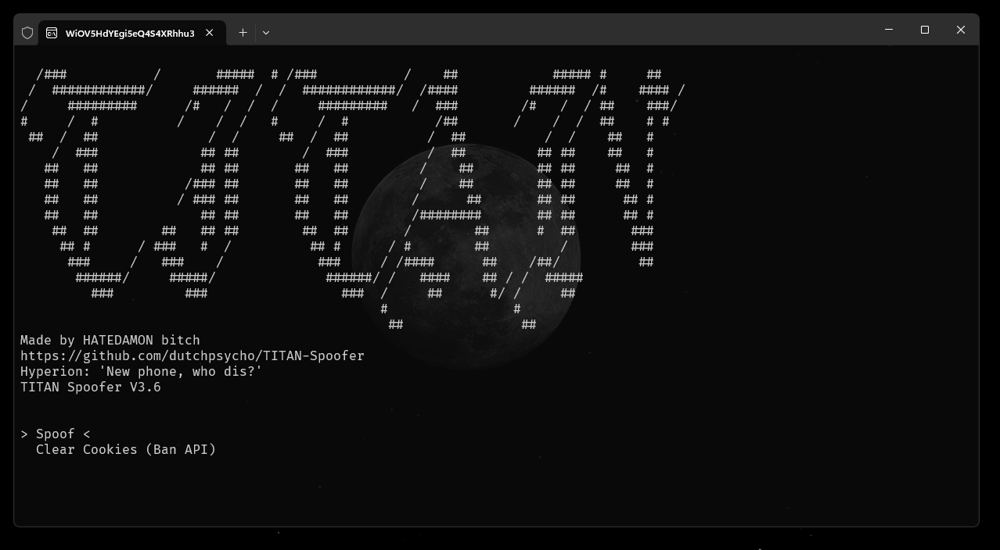
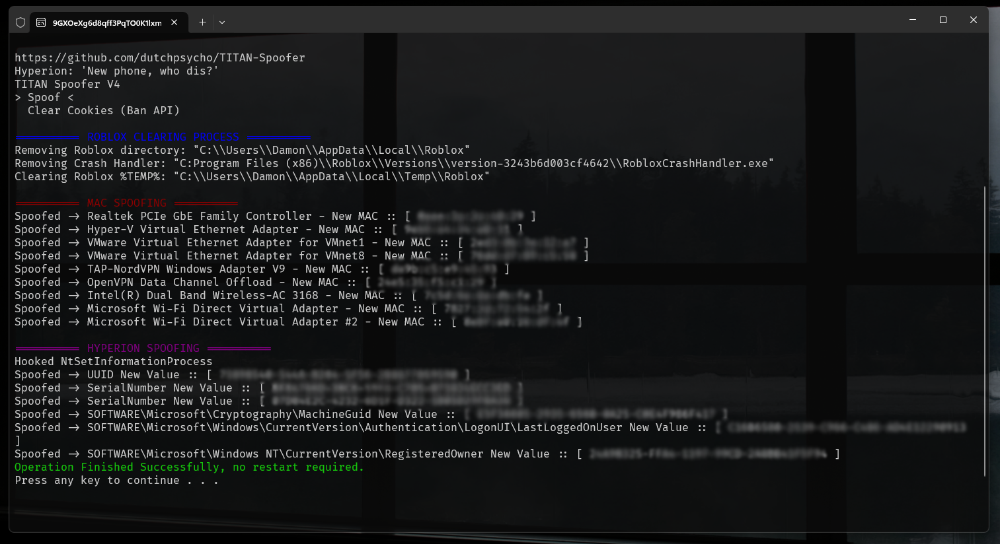

# TITAN Spoofer (Roblox, Hyperion)

TITAN © 2024 by Damon is licensed under CC BY-NC-ND 4.0
 

.png)

**[TITAN's](https://discord.gg/yUWyvT9JyP)** Spoofer is a tool designed to spoof various hardware identifiers (HWIDs) and cookies on your PC to evade Hyperion's detection mechanisms and Roblox's ban API.

[](https://creativecommons.org/licenses/by-nc-nd/4.0/)
[](https://discord.gg/yUWyvT9JyP)

# V.3.6 -> V4.0 📈

- Confirmed spoofer works as of banwave on 2024-08-23(23rd Aug, 2024)
- Completely resolved all MAC spoofing issues & bugs
- Changed to use Windows Instrumentals for MAC spoofing
- Changed the way the CLI handles logs
- Refactored Project Layout & Solution
- Removed useless functionality (SigFucker Mem)

<details>
  <summary><h2>V.3.1 -> V3.6 📈</h2></summary>

- Added Headless version (No UI, just run to spoof, can be put in startup)
- Added targeted Browser Cookie Cleaning (Option on UI version, not included in Headless)
- Added backup for this in case `SQL3.dll` fails or dynamic linking fails `(Python/CookieCacheCleaner.py)`
- Added DebugProtect from Roblox
- Added useful logging
- Added fallbacks depending on spoofs
- Fixed E-DID spoofing
- Fixed WMIC initialization
- Removed useless registry spoofs
- Fixed rare buffer overflow 
- Removed restoration logic (Annoying to maintain, nobody uses it)

</details>

## Features 💍

- **System Spoofing** 🖥️ Spoofs keys and cleans files that Roblox and Hyperion use to detect alt accounts.
- **Roblox Cookie Cache Cleaner** 🍪 Cleans Roblox.com cookies & trackers from a specified browser.
- **Headless/NonHeadless** ⚙️ Compile the spoofer without a command line so it can be put in startup / ran without interference. This is controlled by the `#define HEADLESS` in `Master.cpp`.
- **No System Instability** ⚠️ This spoofer doesn't spoof anything that'll break anything on your PC. It operates in UserMode, not the Kernel.

<details>
  <summary><h2>Installation 📦</h2></summary>

If you prefer not to compile the code yourself, you can download the exe's from **[TITAN's Discord](https://discord.gg/yUWyvT9JyP)**. Otherwise, follow the guide below.

1. **Clone the repository:**

    ```sh
    git clone https://github.com/dutchpsycho/TITAN-Spoofer.git
    cd TITAN-Spoofer
    ```

2. **Open the Solution File (.sln):**

   - Launch Visual Studio (The purple one, not blue)
   - Navigate to the directory where the repository was cloned.
   - Open the `TITAN Spoofer.sln` file.

3. **Configure Build Settings:**

   - Ensure that the build configuration is set to `Release` mode.
   - Select the appropriate platform (`x64`).

4. **Build the Project:**

   - Click on `Build > Build Solution` in the Visual Studio menu.
   - The compiled binaries will be located in the `/x64/Release` directory.

</details>

<details>
  <summary><h2>Information 🌐</h2></summary>

Hyperion is Roblox's Anti-Tamper owned by Byfron. Roblox owns Byfron.

1. **SQL3.dll:**
   - Required for `TITAN_Spoofer.exe` (Library for SQLite3).
   - If you move `TITAN_Spoofer.exe`, ensure you move `SQL3.dll` with it or create a shortcut.

2. **HEADLESS_TITAN_Spoofer.exe:**
   - Does not require `SQL3.dll`.
   - Does not clear the Roblox cookie cache.
   - Can be used in startup.

3. **TITAN_Spoofer.exe:**
   - Includes a Command Line Interface (CLI) navigated by arrow keys.
   - Provides an option to clear your Roblox cookie cache.
   - Use this executable if you need CLI functionality.

4. **HEADLESS_TITAN_Spoofer.exe:**
   - Does not include the CLI.
   - Acts the same as the "Spoof" command in `TITAN_Spoofer.exe`.
   - Controlled by the `#define HEADLESS` directive in `Master.cpp`.

5. **Cache Cleaner:**
   - If the cache cleaner in `TITAN_Spoofer.exe` is not working, use `Python/CookieCacheCleaner.py` to clear the Roblox cookie cache.

6. **Spoofing on Startup:**
   - Press `Windows + R`, type `shell:startup`, and press Enter.
   - Create a shortcut to `HEADLESS_TITAN_Spoofer.exe` in the startup folder, or drag the `.exe` file there.
   - Note: This method does not work for `TITAN_Spoofer.exe` (CLI version).

</details>

## Credits 🎓

- **Lead Developer:** Swedish.Psycho
- **Contributors:** livinlavisa, .ranu., bstaipan

### Disclaimer ⚠️

This software is intended for educational and research purposes only. Using this tool to bypass security measures or violate the terms of service of any software, including Roblox, is strictly prohibited. The developers do not endorse or support any illegal activities and will not be held responsible for any misuse of this software.
