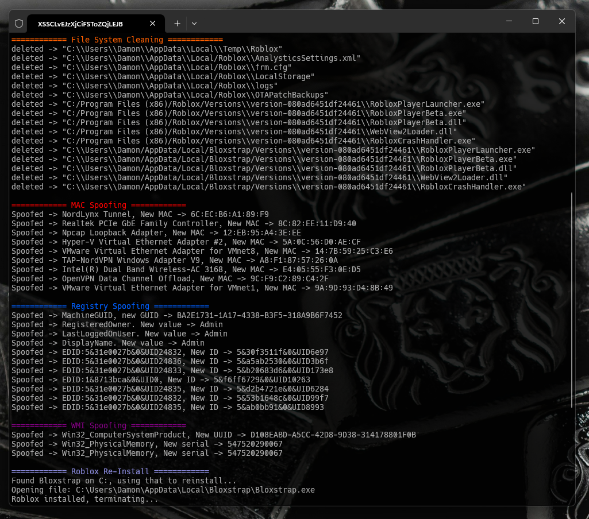

# **TITAN Spoofer** (Roblox, Hyperion)

**TITAN Softwork Solutions © 2024**

 
  

  
  

---

## **📌 Overview**

[TITAN](https://titansoftwork.net)'s Spoofer is a security utility designed to prevent account bans while using exploits on **Roblox for Windows/Web**.  

With Roblox integrating a ban API and combining Hyperion’s (Byfron) detection mechanisms, exploit developers have begun offering paid spoofers. I've decided to give the community a **free, open-source** solution.  

### **How It Works**
The spoofer anonymizes system identifiers before and after an exploit session, effectively resetting your system’s digital footprint. This prevents Roblox from associating your device with previous accounts played on.

---

## **💎 Features**
- **Hyperion HWID Bypass** – Spoofs all relevant hardware identifiers monitored by Hyperion.  
- **Automated Roblox Reinstallation** – Uses **Bloxstrap** for reinstallation, with **RobloxInstaller** as a fallback.  
- **Full Hardware Unban** – Restores access if you are HWID-banned by Hyperion.  
- **Antiban Guide** – Includes a comprehensive guide on avoiding bans and recovering accounts, available in the **[TITAN Discord](https://titansoftwork.net)**.  

---

## **⚠️ Important Notes**
- This tool **does not** unban **Roblox accounts** that have been banned **onsite** (i.e., account-level bans managed server-side).  
- This does not apply to **individual game bans**, as those are enforced by specific game developers.  

---

## **📦 Installation & Setup**
### **🔽 Download**
For prebuilt binaries, download the latest version from **[TITAN](https://titansoftwork.net).**  

### **📚 Requirements**
- **Visual Studio** (Latest Version)  
- **C++ Build Tools** (Install via Visual Studio Installer)  

### **🖥️ Build from Source**
1. **Clone the Repository**  
    ```sh
    git clone https://github.com/dutchpsycho/Roblox-TITAN-Spoofer-Hyperion.git
    cd TITAN-Spoofer
    ```

2. **Open the Solution File (`.sln`)**  
    - Navigate to the cloned repository.  
    - Open `TITAN Spoofer.sln` using **Visual Studio**.  

3. **Build the Project**  
    - Click **Build Solution**.  
    - The compiled executable (`.exe`) will be located in the `/Release` directory.  

---

## **💻 Developer Integration**
### **🔹 `TITAN.h`**
A lightweight API is provided via **`TITAN.h`**, allowing seamless integration of the spoofer into external projects. Logging is fully configurable.

#### **Example Usage**
```cpp
#include "TITAN.h"

std::thread TitanThread = TitanSpoofer::run(true);

TitanThread.join();
```

### **🔹 API Reference**
#### **Function:** `TitanSpoofer::run(bool logs)`
- **Parameters:**
  - `logs` (`true`/`false`): Enables or disables logging. If `false`, suppresses all `std::cout` output except critical errors.  
- **Return Value:** A `std::thread` object executing the spoofing process asynchronously.  

---

## **📩 Support**
For problems, open a support ticket via the **[TITAN Discord](https://titansoftwork.net)**.  

## **📥 Submitting a Contribution**
Contributions are welcome. Code can always improve.

---

## **⚠️ Legal Disclaimer**
This software is provided for **educational and research purposes only**. The use of this tool to **circumvent security protections** or violate the terms of service of **Roblox or any other platform** is strictly prohibited. The developers **do not endorse or condone** any illegal activities and assume no liability for misuse.
