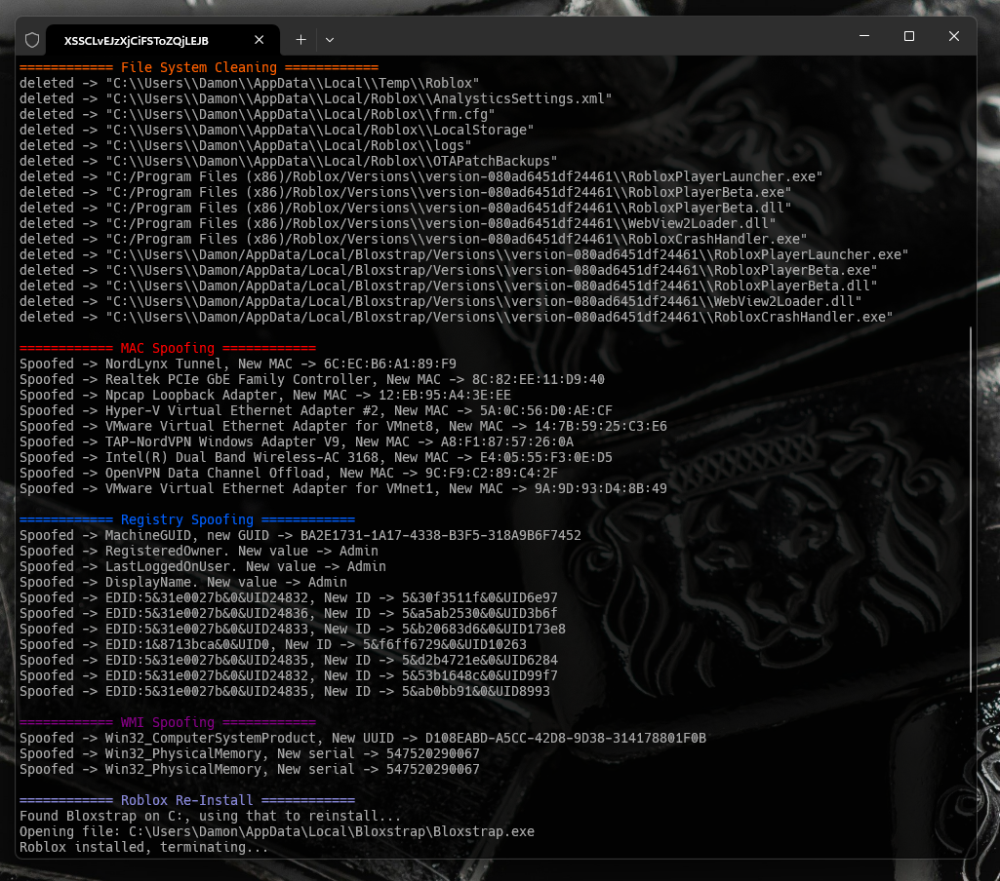

# **TITAN Spoofer** (Roblox, Byfron, Hyperion)

**TITAN Softwork Solutions © 2025**

  
  



 

<br>

# Overview

[TITAN](https://hub.titansoftwork.net)'s Spoofer is a tool designed to prevent your alts from getting banned when exploiting on **Web/Windows Roblox**

With Roblox integrating a ban API and combining Hyperion’s (Byfron) detection mechanisms, exploit developers have begun offering paid spoofers. I've decided to give the community a **free, open-source** solution.

This should be used conjunction with a VPN and knowledge on Roblox's Ban API inner-workings, (research on this can be found in TITAN's Discord)

### How It Works
When ran, the spoofer removes all Roblox traces, randomizes your PC's fingerprint & reinstalls Roblox. The intended way for this to be used is to spoof before & after playing on an exploiting account.

<br>

# Compatability
This works with the following
- Bloxstrap
- Fishstrap
- AWP
- Any other executor to my knowledge

### Important Notes
- This tool **does not** unban **Roblox accounts** that have been banned **onsite** (i.e., account-level bans managed server-side).  
- This does not apply to **individual game bans**, as those are enforced by specific game developers.
- This does NOT prevent IP bans, this does NOT act as a VPN.

<br>

# Installation & Setup
### 🔽 Download
For prebuilt binaries (exe's), download the latest version from the **[Discord](https://hub.titansoftwork.net).**  

### Requirements for compiling
- **Visual Studio**
- **C++ Build Tools** (Install via Visual Studio Installer)

1. **Clone the Repository**  
    ```sh
    git clone https://github.com/dutchpsycho/Roblox-TITAN-Spoofer-Hyperion.git
    cd Roblox-TITAN-Spoofer-Hyperion
    ```

2. **Open the Solution File (`.sln`)**  
    - Navigate to the cloned repository.  
    - Open `TITAN Spoofer.sln` using **Visual Studio**.  

3. **Build the Project**  
    - Click **Build Solution**.  
    - The compiled executable (`.exe`) will be located in the `/Release` directory.  

<br>

# API
### `TITAN.h`
A lightweight API is provided via **`TITAN.h`**, allowing seamless integration of the spoofer into external projects.

#### Example Usage
```cpp
#include "TITAN.h"

std::thread TitanThread = TitanSpoofer::run(true);

TitanThread.join();
```

### **API**
```cpp
Services::KillRbx();
FsCleaner::run();
MAC::MacSpoofer::run();
Registry::RegSpoofer::run();
WMI::WmiSpoofer::run();
FsCleaner::Install();
```

<br>

# Legal Disclaimer
This software is provided for **educational and research purposes only**. The use of this tool to **circumvent security protections** or violate the terms of service of **Roblox or any other platform** is strictly prohibited. The developers **do not endorse or condone** any illegal activities and assume no liability for misuse.
