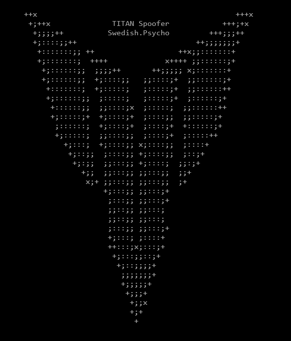

# TITAN Spoofer (Roblox, Hyperion)

TITAN Softwork Solutions © 2024




.png)

# 🗨️ Info

**[TITAN's](https://titansoftwork.net/)** Spoofer is a tool designed to prevent your Main/Other accounts from being banned while exploiting on Windows/Web Roblox.

Recently, Roblox introduced it's ban API & combined it with Hyperion's (Byfron) detection system, after seeing executor developers create paid spoofers I decided to do the exploiting community a favour & make a free one.

The idea is to spoof before & after you've exploited, the Spoofer essentially gives your PC a "Clean Slate" so Roblox will have no clue who you are.

# 💎 Features

- 🔑 **Hyperion HWID System Bypass**: Spoofs all identifiers Hyperion checks.
- 📦 **Reinstalls Roblox**: Assuming you have Bloxstrap (And haven't put it somewhere weird) It'll use that to reinstall quickly.
- ⚖️ **Hardware Unban**: If you're HWID banned (Hyperion banned) this'll fix that for you.
- 📖 **Antiban Guide**: A complete guide to preventing getting banned & getting unbanned exists within the TITAN Discord.

<br>

# Disclaimer ⚠️

This WILL NOT unban you if your Roblox account is banned ONSITE, that's handled server-side there's nothing I can do about that. This also applys to being banned on a specific game.

<br>

# 📦 Installation & Setup

Don't want to compile? **[Download the program directly from the Discord](https://titansoftwork.net).**
 
### 📚 Requirements

Visual Studio & C++ build tools from Visual Studio Installer

### 🖥️ Guide

1. **Clone the Repo**

    ```sh
    git clone https://github.com/dutchpsycho/Roblox-TITAN-Spoofer-Hyperion.git
    cd TITAN-Spoofer
    ```

2. **Open the Solution File (.sln)**

    - Open the cloned repository directory.
    - Open `TITAN Spoofer.sln` in Visual Studio.

3. **Build the Project**

    - Click build solution
    - The compiled binarie (exe) will be located in the `/Release` directory.

<br>

# 💻 For Developers

### `TITAN.h`

I've included TITAN.h for you to include in your software. Each spoof vector can be toggled, console logging also toggleable, its all up to you.

#### Example Integration

```cpp
#include "TITAN.h" // include TITAN.h

    std::thread TitanThread = TitanSpoofer::run(true)

    // wait 4 completion
    TitanThread.join();
```

### API

**Function: `TitanSpoofer::run(bool logs)`**

- **Params:**
  - `logs` (`true`/`false`): Controls whether logging is enabled. If `false`, suppresses all `std::cout` output except errors.
- **Return Value:** A `std::thread` object that executes the spoofing process.

---

# 🎟️ Support

Join the [Discord Community](https://titansoftwork.net) for support, updates, & the community.

<br>

# ⚠️ Disclaimer

This software is intended for educational and research purposes only. Using this tool to bypass security measures or violate the terms of service of any software, including Roblox, is strictly prohibited. The developers do not endorse or support any illegal activities and will not be held responsible for any misuse of this software.
