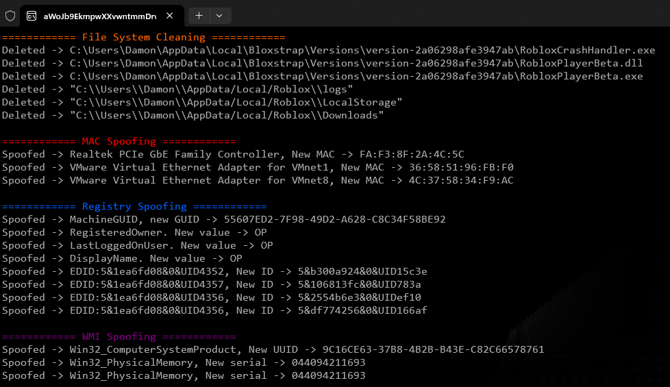

# TITAN Spoofer (Roblox, Hyperion)

TITAN Softwork Solutions © 2024



.png)

# 📜 Context

**[TITAN's](https://titansoftwork.net/)** Spoofer is a tool designed to prevent you from being banned when using executors on Web Roblox.

Recently, Roblox introduced it's ban API & combined it with Hyperion's (Byfron) detection vectors, after seeing executor developers create paid spoofers I decided to do the exploiting community a favour & make a free one.

The idea is to spoof after you've exploited, before you go back onto your main. Once you're done with your main & wanna exploit again, spoof. You get the idea (Hopefully)

# 💎 Features

- 👥 **Ban API & Alt Detection evasion**: Using this clears any previous identities Roblox had on you, meaning any account you launch now is brand new in Roblox eyes.
- 🔐 **Hyperion/HWID Unban**: If you're HWID banned (Hyperion banned) this'll fix that for you.
- 📚 **Complete Anti-Ban Bible**: A complete Anti-Ban guide exists within the official TITAN Discord.

<br>

# Disclaimer 🚨

This won't unban you if your Roblox account is banned, that's handled server-side nothing I can do about that. This also won't get you unbanned from Roblox games, however it will get rid of any ban traces and allow you to work around Ban API if used correctly.

# 📈 Version History

Previous versions are irrelevant, I've fully rewritten this project as of Novemember 2024. In future (Hyperion V5) this project will be updated.

<br>

# 📦 Installation & Setup

Prefer not to compile the code yourself? **[Download the exe from TITAN's Discord](https://titansoftwork.net).**

### 📚 Requirements

Visual Studio & It's C++ build tools

### 🖥️ Guide

1. **Clone the Repo**

    ```sh
    git clone https://github.com/dutchpsycho/Roblox-TITAN-Spoofer-Hyperion.git
    cd TITAN-Spoofer
    ```

2. **Open the Solution File (.sln)**

    - Open the cloned repository directory.
    - Open `TITAN Spoofer.sln` in Visual Studio.

3. **Build the Project**

    - Click build solution
    - The compiled binarie (exe) will be located in the `/Release` directory.

**Usage Reminder:**
- Spoof after exploiting and before returning to your main account.
- Repeat spoofing before each new exploit session.

<br>

here’s the updated guide with more details for developers, specifically about using the `TITAN.h` file in their projects:

---

# 🔱 For Developers

### What’s Provided in `TITAN.h`

I've included TITAN.h for you to use. It's modular & can be integrated with logging or without, single threaded or multi & is extremely flexible with what to spoof.

### What does it do?

Essentially the same thing as spoofer, but you can customize the process, if this is for your executor I'd reccomend running it before Roblox opens, unless you want to kill Roblox or disable the file system cleaning.

#### Example Integration

```cpp
#include "TITAN.h" // include TITAN.h

    std::thread TitanThread = TitanSpoofer::run(true)

    // wait 4 completion
    TitanThread.join();
```

---

### 🔧 Options

**Function: `TitanSpoofer::run(bool logs)`**

- **Parameters:**
  - `logs` (`true`/`false`): Controls whether logging is enabled. If `false`, suppresses all `std::cout` output except errors.
- **Return Value:** A `std::thread` object that executes the spoofing process.

---

# 🎟️ Get Support

Join the [Discord Community](https://titansoftwork.net) for support, updates, & the community.

<br>

# ⚠️ Disclaimer

This software is intended for educational and research purposes only. Using this tool to bypass security measures or violate the terms of service of any software, including Roblox, is strictly prohibited. The developers do not endorse or support any illegal activities and will not be held responsible for any misuse of this software.
